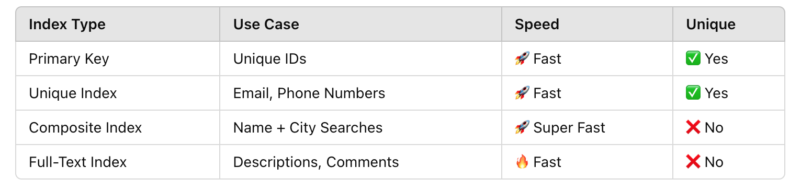
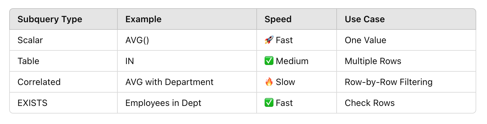
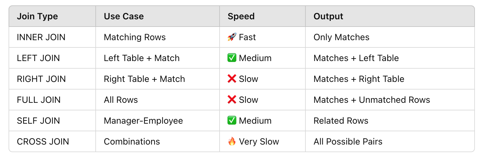

# SQL
An Introduction to Databases and Queries

# What is SQL
* Programming Language for communicating with data in databases. 
* It lets us quickly access , organize and analyze large amounts of data with dirrect commands known as queries. 

# Database 
* Several tables makes up a databases
* In a relational databases the tables have connection based on any shared data
* A table name should be `clear` , use `underscore` instead of spaces, `singular` and should be `lowercased`. 
* Rows are `records` and columns are `fields`.
* Two fields in a table should not have the same name and neither name of the table. 
* A unique identifier distinguishes a record from others in the same table.

# Storage and Data-Types
* Data is stored on server hardisk
* Datatype depends on the information stored in a column
* We also have to see the operations which can be made between two values
* `INT` can hold values from `negative two billion` to `positive 2 billion` 
* `FLOAT` can hold values upto `38 digits`
* `VARCHAR` is used for strings
* `DATE`    used to store date 
* `TIMESTAMP` used to store time  `YYYY-MM-DD HH:MM:SS`
* `BLOB` binary large object

# Schema 
* A schema shows a database design such as what tables are included , any relationship between its tables and what type each field can hold

# Aggregation 
* Aggregation functions in SQL are used to perform calculations on a set of values and return a single value. Here are examples of queries using each of the aggregation functions you mentioned: `COUNT()`, `SUM()`, `AVG()`, `MAX()`, and `MIN()`
Aggregation functions are often used with the `GROUP BY` clause to group results by a specific column.
The `HAVING` clause is used to filter results after aggregation.

# View 
* Creates a virtual table based on a query.
* The point of creating a view is to simplify complex queries, enhance security, and provide a reusable and consistent way to access data. 

# Transaction
* A transaction is a sequence of SQL operations executed as a single unit of work.
* It ensures data integrity by allowing changes to be `committed (saved)` only if all operations succeed, or `rolled back (undone)` if any operation fails.
* Most common example is` bank funds transfer`. 

# Procedures 
* A Stored Procedure is used to `group multiple SQL statements `into one `reusable unit` — making database operations more efficient, secure, and manageable.
* Key Reasons to Use Stored Procedures:
`Code Reusability`:Write the logic once and reuse it anytime by calling the procedure.
`Performance Boost`:Precompiled and optimized by the database engine — faster than writing queries every time.
`Security`:Prevent `SQL Injection` by using parameterized queries.
`Easy Maintenance`:If business logic changes, just update the procedure — no need to modify the whole application.
`Modular Programming`:Break complex operations into smaller reusable procedures.

* ## When Should You Use Stored Procedures?
* Repeated Queries     
* Complex Business Logic 
* Bulk Insert/Update 

# Triggers
* A Trigger is an automatic action executed when a specific event (INSERT, UPDATE, or DELETE) happens on a table. Triggers help maintain data integrity or log changes automatically.

# ENUMS (SPECIAL COLUMN TYPE)
* An ENUM is a special column data type that stores predefined, fixed values. It helps to restrict users to select only from a list of allowed values (like dropdown options).

# Indexing 
* Indexing is a performance optimization technique that speeds up data retrieval in SQL tables. Indexes create a lookup table that allows the database to find rows faster without scanning the entire table.
* You can create an index on multiple columns to speed up searches with multiple conditions known as `composite index`
* A `Unique Index `ensures that no two rows have the same value in the indexed column.
* `Full-Text Indexes` help in searching text data within large documents or descriptions.
* Always create an index on `Foreign Key Columns `to `speed` up `JOIN queries`. 
For example ```sql CREATE INDEX idx_department ON employees(department_id);```
*  Index Types Overview 


# Sub-Query 
* A Subquery is a query inside another SQL query that helps to fetch data from one query and use it as a condition or value in the main query.
* A subquery is enclosed in parentheses ( ) and can return:
Single Value (Scalar Subquery)
Multiple Values (Table Subquery)
Entire Tables (Correlated Subquery)
* Overall Summary


# Joins 
* A JOIN combines rows from two or more tables based on a common column (usually a foreign key).
* When to use which? 
